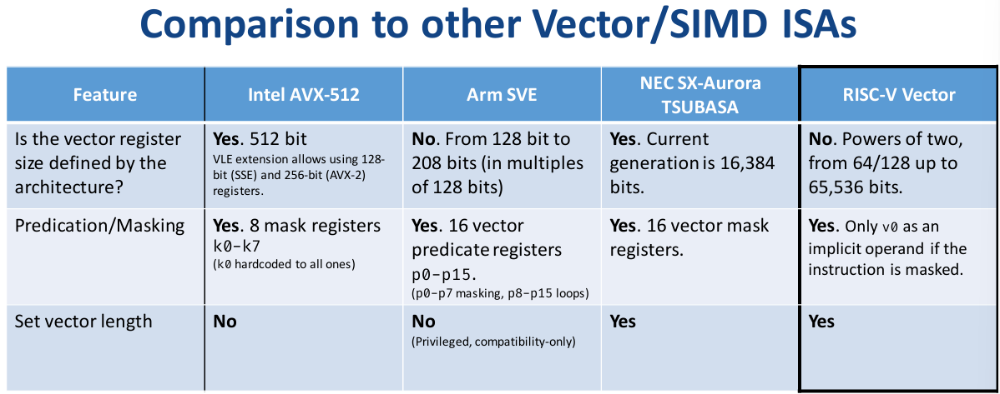

# Intro 

The difference between SIMD and Vector

Vector register is mutable, flexible



.c to .exe: `clang-14 --target=riscv64-unknown-elf -march=rv64gcv --gcc-toolchain=/opt/riscv -O2 -g ./rvv.c -o ./rvv` or `riscv64-unknown-linux-gnu-gcc -static -march=rv64gcv rvv.c -g -o rvv`

.c to .s: `clang-14 --target=riscv64-unknown-elf -march=rv64gcv --gcc-toolchain=/opt/riscv -O2 -S ./rvv.c -o ./rvv.s`

qemu: `qemu-riscv64 -cpu rv64,v=true ./rvv`, 需要新版本qemu

debug qemu: `qemu-riscv64 -g 1234 -cpu rv64,v=true ./rvv` and `riscv64-unknown-elf-gdb -q ./rvv` and `target remote :1234`

## Reference

[BSC: Introductiontothe RISC-V Vector Extension](https://eupilot.eu/wp-content/uploads/2022/11/RISC-V-VectorExtension-1-1.pdf)

[The RISC-V Instruction Set Manual Volume I](./Reference/unpriv-isa-asciidoc.pdf)

# RVV 

## Registers 

32 vector registers (v0-v31), each has a fixed **VLEN** bits of state

7 unprivileged CSRs(vstart, vxsat, vxrm, vcsr, vtype, vl, vlenb)

VLEN(vector register size(in bits))

ELEN(elements length)

vtype: Vector Type 
    sew: standard elements width, 8<=sew<=ELEN
    lmul:length multiplier, allows grouping registers(lmul = 2^k, -3<=k<=3)

vl: Vector Length (not to VLEN), **how many** elements of the vector
    0<=vl<=vlmax(sew,lmul)
    vlmax(sew, lmul) = (VLEN/sew)*lmul

vlmax 最多能够容纳多少元素

vl 当前有多少元素

lmul=1 all elements of a vector register

lmul<1 1/2, 1/4 or 1/8 elements of vector register

lmul>1 uses vector group

vl < vlmax, there are elements not operated, called **tail elements**

tail undisturbed: tail elements not modified.

tail agnostic: tail undisturbed or bits of all tail elements set to 1.

## Masking (Predication)

mask vector: is a vector whose elements are single bits

Instructions can be maskes using v0 register

a little bit like psw in arm.

v0 register determines whether a **non-tial** element is **active** or **inactive**

active elements operate as usual, and inactive elements not operate at all.

Policy for inactive elements: (likely to the tail elements policy)
1. mask undisturbed
2. mask agnostic

## Setting vl and vtype

vsetvl / vsetvli / vsetivli 

vle*ff

common one: vsetvli rd, rs, eN, mX, tP, mP

rs: an input register operand that contains the application vector length (**AVL**) which represents the **vector length**

    vsetivli: replace this operand with a small immediate from 0 to 31

N in eN: sew (e8, e16, e32...)

X in mX: lmul (mf8, mf4, mf2, m1, m2, m4, m8)

P in tP and mP: Policy (**u** for undisturbed or **a** for agnostic)

Special cases: 
1. vsetvli rd, x0, eN, mX, tP, mP # rd != x0 (Sets vl to vlmax(sew=N, lmul=X) vtype to sew=N, lmul=x)
2. vsetvli x0, x0, eN, mX, tP, mP (only change vtype; only valid when the new vlmax is left unchanged) 

### AVL > vlmax(sew, lmul) ?

if AVL > vlmax(sew, lmul), vl = min(vlmax(sew, lmul), AVL)

or if vlmax(sew,lmul) < AVL < 2*vlmax(sew,lmul), ceil(AVL / 2) ≤ vl ≤ vlmax(sew, lmul)

ceil 上取整

第二种方法，导致不精确值


~~## Context status in mstatus~~

~~VS: defined analogously to the floating-point context status field, FS~~

# Instructions

**功能分类：操控寄存器，访存，算数逻辑，类型转换**

**类型分类：v x w imm mask**

vle8.v vle16.v vle32.v vle64.v

vse8.v ...

vluxei8.v vd, (rs1), vs2, vm vluxei16.v ...

vlm.v  vsm.v

vadd.vv vadd.vx vadd.vi

vsub.vv vsub.vx

vrsub.vx vrsub.vi

vwaddu.vv vwaddu.vx vwsubu.vv vwsubu.vx

vwadd.vv vwadd.vx vwsub.vv vwsub.vx

vwaddu.wv vwaddu.wx vwsubu.wv vwsubu.wx

vwadd.wv vwadd.wx vwsub.wv vwsub.wx

vzext.vf2 vsext.vf2 vzext.vf4 vsext.vf4 vzext.vf8 vsext.vf8

vadc.vvm vadc.vxm vadc.vim vmadc.vvm vmadc.vxm vmadc.vim vmadc.vv vmadc.vx vmadc.vi

vand.vv vand.vx vand.vi vor.vv vor.vx vor.vi vxor.vv vxor.vx vxor.vi

vsll.vv vsll.vx vsll.vi vsrl.vv vsrl.vx vsrl.vi vsra.vv vsra.vx vsra.vi

vnsrl.wv vnsrl.wx vnsrl.wi vmsra.wv vmsra.wx vmsra.wi

vmseq.vv vmseq.vx vmseq.vi vmsne.vv vmsne.vx vmsne.vi vmsltu.vv vmsltu.vx vmslt.vv vmslt.vx vmsleu.vv ... vmsgtu.vx ... vmsgt.vx ... 

vminu.vv vminu.vx vmin.vv vmin.vx vmaxu.vv vmaxu.vx vmax.vv vmax.vx

vsaddu.vv vsaddu.vx

## 命名规则

### policy and masked

vm vta vma

no suffix: unmasked(vm=1) and tail-agnostic(vta=1)

_tu suffix: unmasked(vm=1) and tail-undisturbed(vta=0)

_m suffix: masked(vm=0) and tail-agnostic(vta=1) and mask-agnostik(vma=1)

_tum suffix: masked(vm=0) and tail-undisturbed(vta=0) and mask-agnostic(vma=1)

_mu suffix: masked and tail-agnostic and mask-undisturbed

_tumu ...

m: repersents mask

tu: repersents tail-undisturbed

mu: repersents masked and mask-undisturbed

without u(tu/mu): agnositic

### Explicit naming scheme

__riscv_{V_INSTRUCTION_MNEMONIC}_{OPERAND_MNEMONIC}_{RETURN_TYPE}_{ROUND_MODE}_{POLICY}{(...)}

### reduction 

能表示的元素个数不变：

vl = vlen / sew * lmul


``` c

for(int i=1;i<=n;i++)
    cout<<a[i]<<" \n"[i==n];

```