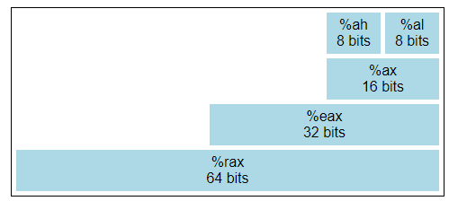
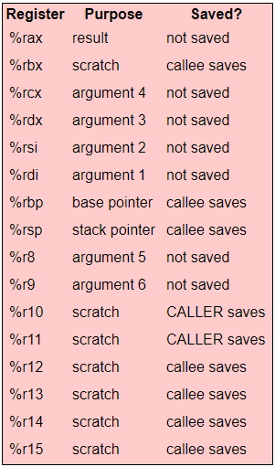

# Difference

CISC - RISC

## 寄存器
x86寄存器：

x86: %rax %rbx %rcx %rdx %rsi %rdi %rbp %rsp %r8 %r9 %r10 %r11 %r12 %r13 %r14 %r15



不同位宽的寄存器之间，使用相同的寄存器空间

## 寻址

x86中 word = 2bytes

riscv中 word = 4bytes

## 指令结构

x86中指令 目的寄存器和一个源寄存器合并 op arg1, arg2

两种指令格式 AT&T, Intel: 甚至源和目的寄存器的位置不同

## 指令

imul arg: %rax 乘以 arg， 结果低位放%rax, 结果高位放%rdx

div arg: 以%rax:%rdx为被除数，除以arg，结果的商放%rax,余数放%rdx

有自增自减指令 inc, dnc

寻址的格式不同

## 栈

x86 有 push pop 指令

## 调用规约

x86: System V ABI


1. 整数参数(包含指针) 依次放在%rdi, %rsi, %rdx, %rcx, %r8, 和 %r9 寄存器中
2. 浮点参数依次放在寄存器%xmm0-%xmm7中
3. 寄存器不够用时，参数放到栈中
4. 可变参数哈函数(比如printf), 寄存器%eax需记录下浮点参数的个数
5. 被调用的函数可以使用任何寄存器，但它必须保证%rbx, %rbp, %rsp, and %r12-%r15恢复到原来的值（如果它改变了它们的值）
6. 返回值存储在 %eax中

## 并行

AVX（Advanced Vector Extensions）指令：Vector

AVX寄存器 256/512/128bits

# Register

现代处理器 8个32位通用寄存器
```
<reg32> ; 任何32位寄存器 （EAX, EBX, ECX, EDX, ESI, EDI, ESP, or EBP）
<reg16>	; 任何16位寄存器 （AX, BX, CX, or DX）
<reg8>	; 任何8位寄存器 （AH, BH, CH, DH, AL, BL, CL, or DL）
<reg>	; 任何寄存器
<mem>	; 一个内存地址 （e.g., [eax], [var + 4], or dword ptr [eax+ebx]）
<con32>	; 任何32位常量
<con16>	; 任何16位常量
<con8>	; 任何8位常量
<con>	; 任何8、16、32位常量
```
## General 

eax ebx ecx edx esi edi

## Reserved 

ebp esp eip eflags

eip: instruction pointer   (其实是program counter)

elags: 进位，溢出，零，负数 (CF, OF, ZF, SF)

# Stack

ebp: base pointer

esp: stack pointer


# Instruction Format

数据移动，算数/逻辑， 控制流

operation arg

operation arg, arg

mov arg1, arg2

[]: 寻址

mov eax, ebp - 0x8 移动 ebp - 0x8 这个地址到eax

mov eax, [ebp - 0x8] 移动 ebp - 0x8 的内容到eax

push arg 

pop reg

lea (load effective address): lea reg, addr

cmp arg1, arg2 执行 arg1 - arg2 并记录状态（<0等）

jmp addr -> eip = addr

call func -> push eip; jmp func

IDIV指令将64位整数EDX:EAX（通过将EDX视为最高有效四个字节，EAX视为最低有效四个字节）的内容除以指定的操作对象值。除法的商结果存储在EAX中，其余数的存储在EDX中。

idiv ebx


# dump to .asm

.DATA: 静态数据区域 DB DW DD 声明一个/两个/四个字节的数据

```
Z DD 1, 2, 3        ; 声明三个4字节值，初始化为1、2和3。位置Z+8的值将为3
bytes DB 10 DUP（?）  ; 从位置bytes开始声明10个未初始化的字节
arr DD 100 DUP（0）   ; 声明100个从位置arr开始的4字节字，全部初始化为0
str DB 'hello',0    ; 从地址str开始声明6个字节，初始化为hello的ASCII字符值和空字节0。
```


# 调用规约

caller-saved： EAX、ECX、EDX

callee-saved： EBX、EDI、ESI

返回值保留为EAX

# 格式 AT&T Intel

AT&T: 带有%表示寄存器，带有$表示立即数

AT&T 和 Intel 格式中的源操作数和目标操作数的位置正好相反