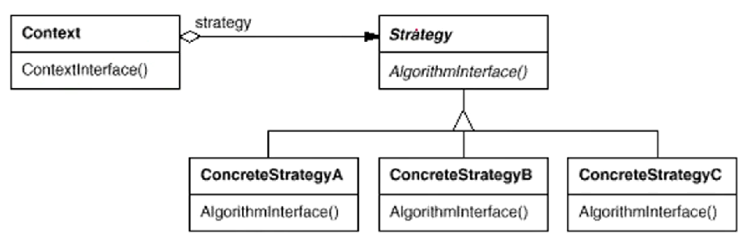
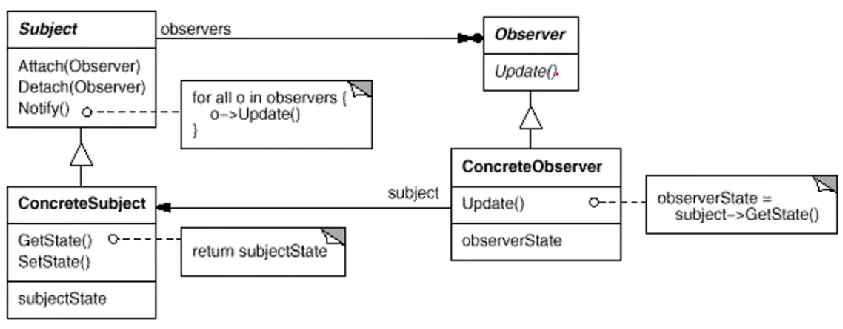

# Intro

设计模式目标：**可复用**

手法：面向对象
 
23中设计模式

底层思维+抽象思维

## 理解

向下：封装、继承、多态

向上：面向对象机制带来的抽象意义

## 设计复杂的原因

变化-客户需求，技术平台，开发团队，市场环境

解决方式：分解，抽象

# 面向对象设计原则

优势：抵御变化

多态调用，各负其责

## 设计原则

1. 依赖倒置原则(DIP): 
   1. 高层模块（稳定）不应该依赖于底层模块（变化），二者都应该依赖于抽象（稳定）
   2. 抽象（稳定）不应该依赖于实现细节（变化），实现细节（变化）应该依赖于抽象（稳定）
   
    **隔离变化**

2. 开放封闭原则(OCP):
   1. 对扩展开放，对更改封闭
   2. 类模块应该是可扩展的，但是不可修改

3. 单一职责原则(SRP):
   1. 一个类应该仅有一个引起它变化的原因
   2. 变化的方向隐含着类的责任

4. Liskov替换原则(LSP):
   1. 子类必须能够替换他们的基类(IS-A)
   2. 继承表达类型抽象

5. 接口隔离原则(ISP):
   1. 不应该强迫客户程序依赖他们不用的方法
   2. 接口应该小而完备

6. 优先使用对象组合，而不是类继承
   1. 类继承通常为“白箱复用”，对象组合通常是“黑箱复用”
   2. 继承在某种程度上破坏了封装性，子类父类耦合度高
   3. 对象组合则只要求被组合的对象具有良好定义的外部接口，耦合度低

7. 封装变化点
   1. 使用封装来创建对象的分界层，让设计者可以在分界一侧进行修改，而不会对另一侧产生不良影响，从而减轻耦合程度

8. 针对接口编程，而不是针对实现编程
   1. 不将变量类型申明为某个特定的具体类，而是申明为某个接口
   2. 客户程序无需获知对象的具体类型，只需要知道对象具体的接口
   3. 减少系统中各部分的依赖关系，从而实现“高内聚，松耦合”的类型设计方案

**接口标准化**核心就是分工协作

## 设计经验

设计习语(Design Idioms)：与特定编程语言相关的底层模式

设计模式(Design Patterns)：描述“类与相互通信的对象之间的阻止关系”

架构模式(Architectural Patterns)：描述系统中与基本结构组织关系密写的高层模式

# 模式方法

## GOF-23 模式分类

目的层面：
1. 创建型：对象的创建工作
2. 结构型：应对需求变化为对象的结构带来的冲击
3. 行为型：应对需求变化为多个交互的对象的冲击

范围层面：
1. 类模式处理类与子类的静态关系
2. 对象模式处理对象间的动态关系

封装变化角度：
1. 组件协作
2. 单一职责
3. 对象创建
4. 对象性能
5. 接口隔离
6. 状态变化
7. 数据结构
8. 行为变化
9. 领域问题

## 重构获得模式 Refactoring to Patterns

寻求变化点，在变化点处应用设计模式

什么时候使用设计模式，比理解设计模式本身更重要

设计模式的应用不宜先入为主，没有一步到位的设计模式

### 重构关键技法

1. 静态->动态
2. 早绑定->晚绑定 
3. 继承->组合
4. 编译时依赖->运行时依赖
5. 紧耦合->松耦合

### 组件协作模式

框架与应用程序的划分

典型：Template Method, Strategy, Observer/Event

### Template Method

有稳定的整体结构，但各个子步骤有很多改变的需求

定义一个操作中算法的骨架（稳定），将一些步骤（变化）延迟到子类；使得子类可以复用一个算法的结构。

重点：分辨哪些是稳定，哪些是变化

``` cpp
class Library {
public:
   Library();
   virtual ~Library(){} // 虚析构函数
   void step1();
   void step3();
   void step5();
   virtual void step2();
   virtual void step4();
   void run() { // 这就是模板
      step1();
      step2(); // 支持多态 -> 虚函数的多态调用
      step3();
      step4();
      step5();
   }
};
/** 晚绑定 */
class Application: public Library {
   virtual void step2();
   virtual void step4();
};
int main() {
   Library* lib = new Application();
   lib->run();
   delete lib;
}
```

# 策略模式 strategy

某些对象使用的算法可能多种多样，且经常改变

运行时更透明地更改对象的算法，将算法与对象解耦

## 模式定义

定义一系列算法，并一个个封装起来，使之可以相互替换。**扩展，子类化**



含有许多 if else 的 多半可以使用strategy

可以通过晚绑定减小内存

# 观察者模式 Observer/Event

为某些对象建立一种“通知依赖关系”，对所有依赖对象进行通知

多继承最佳实现：一个主基类+多个接口类

定义对象间一种一对多的依赖关系，以便一个对象的状态改变时，依赖的对象都得到通知

