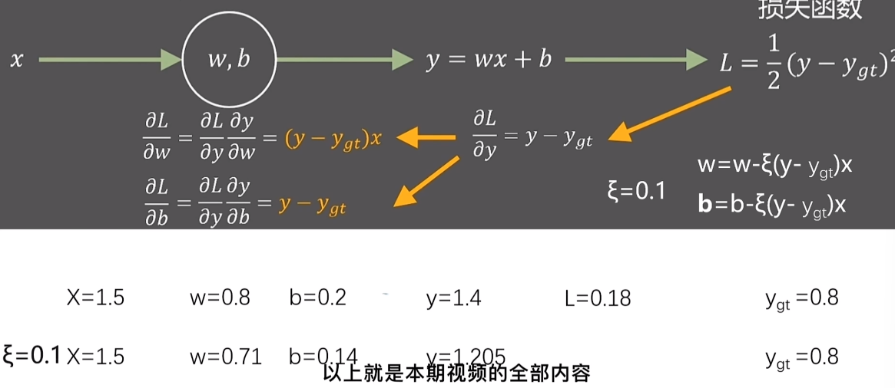

# 与传统编译器的区别

1. 输入文件：传统编译器为输入高级语言，输出低级语言（汇编代码，二进制代码等）；AI编译器为输入计算图，输出汇编代码。
2. 目的：传统编译器的目的首先是简化编程难度，再是优化程序性能；AI编译器目的首先是提高程序性能，再是简化编程难度。

# 使用场景

1. 推理场景: 输入AI框架训练出来的模型文件,输出能够在不同硬件高效执行的程序。

2. 训练场景:输入高级语言表示的神经网络代码,输出能够在不同硬件高效执行的程序。

# 深度学习基础

深度神经网路结构：
1. 神经网络层：输入层 隐藏层（包含激活函数） 输出层
2. 神经元
3. 激活函数：
   1. 非线性
   2. 可微性 
   3. 单调性
4. 损失函数
   1. 衡量预测值与真实值的误差，评估模型性能 

深度神经网络的运行机制：
1. 前向传播 forwards
2. 反向传播 backwards : 根据预测值和真实值（训练集）对梯度进行反向操作（梯度下降）
   
   

## 卷积神经网络 CNN

主要处理计算机视觉，图像

1. 输入层：输入图像
2. 卷积层：特征提取
3. 池化层：降低尺寸
4. 全连接层：计算并输出

输入层：图片-> 三个通道 具有深度的特点（区别于网络的深度）

卷积层：定义卷积核->卷积操作->激活函数

池化层：降采样，缩小数据规模，收集关键数据，提高计算速度，作用是缩小特征图，保留有用信息

    定义池化窗口-> 池化操作-> 重复池化操作

全连接层：对图像的特征进行分类并得到最终输出结果

    将图像特征向量进行输入，通过一组权值计算得到一个分类结果

卷积-感受野：让每个神经元只与输入数据的一个局部区域进行连接，连接的空间大小称作感受野，在深度方向这个连接的大小与输入的深度一样

局部连接：卷积神经网络中神经元只与部分相邻神经元连接

权值共享：卷积神经网络中所有神经元使用的卷积核参数相同

卷积-反向传播：
1. 反向卷积：将输入数据和卷积核进行转置，再进行卷积操作，得到原图（误差梯度图）
2. 梯度计算：通过误差梯度图和当前卷积层的输入数据

