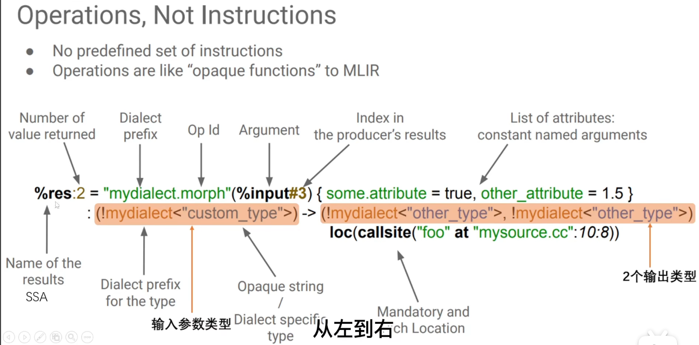

# MLIR

Multi-Level Intermediate Representation 多层级通用编译器IR

常见IR:
1. LLVM IR 是低层级的虚拟指令集
2. Domain Specific SSA-based IR 高层级IR
3. TensorFlow Compiler 多种IR(ML graph 等)

MLIR 可复用, 可扩展的编译器架构的解决方案, 解决实现多套代码的碎片化问题

MLIR 被设计为一种混杂的通用的IR, 支持不同的需求, 更好地统一在MLIR上进行问题处理和优化

MLIR的学习过程如下:
1. 学习MLIR基本模块;
2. 学习MLIR提供的Dialects, 各个Dialects的定位, 以及为弥补软硬件gap, 提供的这些gap的分类和关联。

关于MLIR基本模块学习过程如下: 
1. Dialect, Attribute, Type, Operation; 想象如果自己去实现, 该怎么设计类; 
2. DialectConversion; 想象在自己实现的前四个模块上, 如何实现DialectConversion; 
3. Interface, Constraint, Trait; 同样，想象自己会怎么增加这些功能;
4. Transformation, Concalization; Region, Block: 基于1.设计的Operation, 以及4.增加的Transformation, 想象如何对Operation进行抽象, 提取出Region和Block的概念; 
5. Pass;
6. 最后才是ODS和DRR

[从零开始教你写一个MLIR Pass](https://zhuanlan.zhihu.com/p/708819963)

[Toy Tutorial](https://mlir.llvm.org/docs/Tutorials/Toy/)

# MLIR 表达式

# Dialect

Dialect 其实是一个层级的IR

对 DSL 的抽象
 
 
 
# Toy and AST

编译出 toy 对应的编译器

使用 `path/to/BUILD/bin/toyc-ch1 test/Examples/Toy/Ch1/ast.toy -emit=ast` 生成ast

AST: `/home/nanqin/project/llvm-project/build/bin/toyc-ch1 /home/nanqin/project/llvm-project/mlir/examples/toy/Ch1/ast.toy -emit=ast`

tblgen: `build/bin/mlir-tblgen -gen-dialect-defs mlir/examples/toy/Ch2/include/toy/Ops.td -I ./mlir/include/`

print: `/home/nanqin/project/llvm-project/build/bin/toyc-ch2 /home/nanqin/project/llvm-project/mlir/examples/toy/Ch1/ast.toy -emit=mlir -mlir-print-debuginfo`

参数处理：opt类

