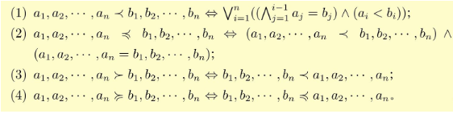

# 程序抽象表示基础


## 在编译器中的作用

幺模变换(unimodular transformation): "幺模"取自线性代数的幺模矩阵(一个所有元素均为整数且行列式的绝对值为1)。幺模矩阵能够表示的变换包括循环交换、循环倾斜、循环反转。

多面体模型的抽象是基于程序语句实例的。用一个集合和多种映射关系的组合、将程序表示成一个迭代空间（集合）、语句和内存单元的访存关系（映射）

构造迭代空间的约束集合，列出循环嵌套的所有上界和下界约束，并统一转化成 **>=0** 的形式。

需注意到：所有的循环索引变量在整个可行解空间中只取整数值，以满足程序的实际应用需求。

再将约束不等式组转化成矩阵形式，方便利用整数线性规划等数学模型来提取特定信息并进行优化。

同时如果循环索引变量还有其他条件：如变量步长限定变量只取奇数 也可表示为 ∃e: (i+1)-2e >= 0 ( ∃e: i+1 = 2e)

```
for(int i=3; i<10; i+=2) {
    for(int j=i; j<N; j++) {
        A[j][i] = 0;
    }
}

# -->

for(int j=3; j<min(N, 10), j++) {  // or ? j<=min(N-1, 9)
    for(int i=3; i<10; i+=2) {
        A[j][i] = 0;
    }
}
```

## 整数集合与仿射函数

对程序进行有效的表示：借助集合和映射关系的基本操作来实现对程序执行顺序的调整

### 静态仿射约束

整数集合(intger set) 和 仿射函数(affine function)/仿射关系(affine relation) 是多面体模型对程序进行表示的数学基础

循环索引变量 取值范围都是整数

用仿射函数/仿射关系来表示 语句和语句之间 或 语句和内存地址之间 的关系

静态仿射约束 static control parts (SCoP)

一个SCoP 指一段满足特定条件的程序语句的最大合集，该条件要求封装这些程序语句的 循环的边界、步长和控制流语句的条件只能是 外层循环索引变量和符号常量的仿射函数

### 整数集合

对循环嵌套内的语句进行实例化的过程是根据循环嵌套的维度进行展开并进行排列的。

以d层循环为例，用一个整数d元组表示语句的维度，再用一个标识符对每个语句进行命名，则该标识符以及d元组就可以表示循环嵌套内的一个语句

S1(i,j): S1 为语句的标识符， （i,j）为循环索引变量构成的二元组， 此为一个标识符和一个整数d元组标识一个命名的整数空间

在整数空间添加各个循环维度的约束（循环边界和循环步长），就得到对应的整数集合

用一个带有约束的命名整数空间标识一个命名的整数集合，每个约束用于标识循环边界和其他程序语义导致限定的边界，约束之间用“;”分隔

#### Preburger语言

约束信息都可以用Presburger公式进行标识， Presburger公式是Presburger语言的一个一阶谓词公式

### 仿射函数

任意两个集合之间都可以构造一个二元映射关系：单射，满射，双满射（一一映射，即是单射也是漫射）

构成映射关系的整数集合之间不一定满足维度相同

整数集合的映射关系可以标识语句的执行顺序，当一个命名的整数空间映射到未命名的整数空间时，可以标识该语句实例的执行顺序，即程序语句的调度（schedule）

程序语句实例执行顺序的映射一般是双射，但特殊情况下也需要用满射

多面体模型关注的时仿射函数，根据仿射函数实现的程序变换称为仿射变换（affine transformation）

仿射函数定义：一个形如 f(i)=Mi+c 的二元映射关系被成为一个仿射函数， i是一个d维向量， M是一个k*d 大小的矩阵， c是一个k维向量。

i可以看作是定义域，f(i)是值域

用 -> 表示两个整数集合之间的二元映射关系

多面体模型可以将一个仿射函数作为一个元素构造有仿射函数构成的集合

在比较多维整数集合之间的大小时，需要用到字典序比较



带有整数除法的表达式被称为近似仿射表达式(quasi-affine expression)， 对应的变换称为近似仿射变换(quasi-affine transformation)

### 集合与映射的运算

对程序进行变换还需要支持基于这些表示的运算

同时，利用整数集合和仿射函数来进行程序的表示也是不够的

在进行整数集合和仿射函数的运算时，需要判定当前运算中的整数集合是否表示相同的语句或者称两个整数空间是否同构

同构整数空间定义：
1. 两个整数空间的命名相同 S1 == T1 
2. 两个整数空间的空间维度一致

当两个整数空间同构时，对两个整数集合并集运算则转换为对两个整数集合的约束Presburger公式之间的析取操作

计算集合的基数(cardinality)

基数定义：
1. 当一个集合S是整数集合，即S可以表示为{S(i):p(i)}时，它的基数card S 被定义为所有满足约束条件的自由变元的个数 card S:= {#i:p(i)}
2. 当一个集合S是仿射函数的集合，S可以表示成 {S(i)->T(j):p(i,j)}，它的基数card S 被定义为每个仿射函数定义域S(i)在该仿射函数下对应像的个数 ~~?像~~ card S:={S(i)->#j:p(i,j)}

#i 表示i的个数

## Fourier-Motzkin 消去法

求解线性规划问题的方法，基本思想与求解线性方程组的高斯消去法类似

## 调度树

语句实例的调度, 即语句实例的执行顺序关系

程序文本中本身的执行顺序为原始调度

