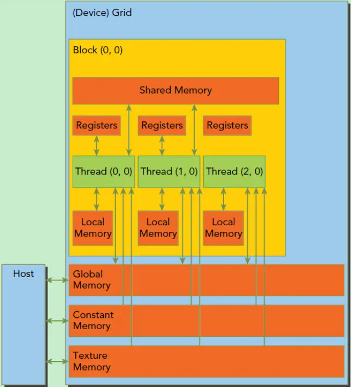

# CUDA generated by ppcg

source file: test.c

A case study on martix multiplication

We have to know that to launch the GPU is expensive, which means we have to make sure the amount of computation is large enough. (10*10 martix is too small， 300*300 martix is large enough)

```
#include <stdlib.h>
#include <memory.h>
#include <stdio.h>
#define X 500
#define Y 500
void MartixInit(int a[][Y], int count) {
	for(int i=0; i<X; i++) {
		for(int j=0; j<Y; j++) {
			a[i][j] = count++;
		}
	}
}

void MartixPrint(int a[][Y]) {
	for(int i=0; i<X; i++) {
		for(int j=0; j<Y; j++) {
			printf("%d\t", a[i][j]);
		}
		printf("\n");
	}
}
int main()
{
	int a[X][Y];
	int b[X][Y];
	MartixInit(a, 1);
	MartixInit(b, 10);
	int c[X][Y];
	
#pragma scop
	for (int i = 0; i < X; ++i)
		for (int j = 0; j < Y; ++j)
			for(int k=0; k < X; ++k)
					c[i][j] += a[i][k]*b[k][j];
#pragma endscop
	MartixPrint(c);
	return EXIT_SUCCESS;
}

```

three file generated:
1. test_host.cu
2. test_kernel.cu
3. test_kernel.h

test_host.cu is executed on host (parbally on CPU)

test_kernel.cu is executed on device (GPU, Nvidia GPU)

## host part

To generate correct CUDA code, there are four part in host code:
1. check the device
2. allocate memory & transmit data
3. launch kernel
4. transmit data & free memory

dimBlock(16, 32) means there are 16*32 threads in this block.

dimGrid(16, 16) means 16*16 blocks in this grid. (grid means whole threads that kernel launched, and all the threads in the same grid can share a global memory)

```
	  {
	    dim3 k0_dimBlock(16, 32);
	    dim3 k0_dimGrid(16, 16);
	    kernel0 <<<k0_dimGrid, k0_dimBlock>>> (dev_a, dev_b, dev_c);
	    cudaCheckKernel();
	  }
```

In this case, a block handle a 32*32 martix, and a thread handle a 1*2 martix.

## kernel part

```__global__``` means this function is executed on device(GPU), and it is a global function

blockIdx, threadIdx are the varaibale to indicate the position of the block or thread 

```__shared__``` means this is a shared memory. In this case it contain the data of array a and b.

private_c is to store the temporal result.

```
#include "test_kernel.hu"
__global__ void kernel0(int *a, int *b, int *c)
{
    int b0 = blockIdx.y, b1 = blockIdx.x;
    int t0 = threadIdx.y, t1 = threadIdx.x;
    __shared__ int shared_a[32][32];
    __shared__ int shared_b[32][32];
    int private_c[1][2];

    #define ppcg_min(x,y)    ({ __typeof__(x) _x = (x); __typeof__(y) _y = (y); _x < _y ? _x : _y; })
    {
      if (32 * b0 + t0 <= 499) {
        private_c[0][0] = c[(32 * b0 + t0) * 500 + (32 * b1 + t1)];
        if (32 * b1 + t1 <= 483)
          private_c[0][1] = c[(32 * b0 + t0) * 500 + (32 * b1 + t1 + 16)];
      }
      for (int c2 = 0; c2 <= 499; c2 += 32) {
        if (32 * b0 + t0 <= 499)
          for (int c4 = t1; c4 <= ppcg_min(31, -c2 + 499); c4 += 16)
            shared_a[t0][c4] = a[(32 * b0 + t0) * 500 + (c2 + c4)];
        if (t0 + c2 <= 499)
          for (int c4 = t1; c4 <= ppcg_min(31, -32 * b1 + 499); c4 += 16)
            shared_b[t0][c4] = b[(t0 + c2) * 500 + (32 * b1 + c4)];
        __syncthreads();
        if (32 * b0 + t0 <= 499)
          for (int c3 = 0; c3 <= ppcg_min(31, -c2 + 499); c3 += 1) {
            private_c[0][0] += (shared_a[t0][c3] * shared_b[c3][t1]);
            if (32 * b1 + t1 <= 483)
              private_c[0][1] += (shared_a[t0][c3] * shared_b[c3][t1 + 16]);
          }
        __syncthreads();
      }
      if (32 * b0 + t0 <= 499) {
        c[(32 * b0 + t0) * 500 + (32 * b1 + t1)] = private_c[0][0];
        if (32 * b1 + t1 <= 483)
          c[(32 * b0 + t0) * 500 + (32 * b1 + t1 + 16)] = private_c[0][1];
      }
    }
}

```

32 * b0 + t0: 

why b0 * 32？ Because the block handle a 32*32 martix.

## poly part in ppcg

ppcg.c:

    main -> generate_cuda
    
cuda.c:

    generate_cuda -> generate_gpu

gpu.c:

    generate_gpu -> ppcg_transform

ppcg.c:

    ppcg_transform -> pet_transform_C_source

...

pet.cc 

    static isl_stat foreach_scop_in_C_source

# GPU's structure

## memory structure

1. local memory

    Every thread has it's local memory
    
2. shared memory

    Every block has it's shared memory, and each thread in that block can access it

3. global memory

    All threads can access it

4. constant memory

5. texture memory

