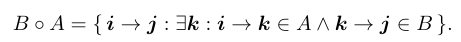
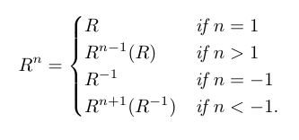
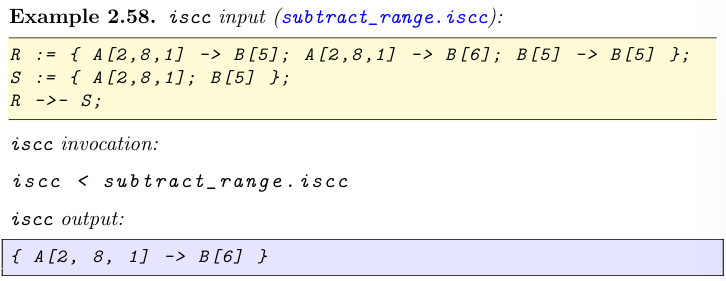

# Intro

Integer Set Library

## Memory Management

__isl_give

__isl_null

__isl_take

__isl_keep

isl_ctx *isl_ctx_alloc();
 
void isl_ctx_free(isl_ctx *ctx);

## 运算

### set

isl_union_set_empty 空集

isl_union_set_intersect 求交集

isl_union_set_union 求并集

isl_union_set_subtract 求差集  (A\B, in A, not in B)

isl_union_set_is_equal 判断是否相等

isl_union_set_is_empty 判断是否为空集

isl_union_set_is_subset 判断是否为子集

isl_union_set_is_strict_subset 判断是否为严格子集

通过反转isl_union_set_is_(strict)_subset参数为位置求（严格）超集

### map

isl_union_map map中元素为二元关系 (->)

isl_union_map_empty 创建空的map

isl_union_map_intersect 求map交集

isl_union_map_union 求map并集

isl_union_map_subtract 求map差集

isl_union_map_reverse 求map的逆

isl_union_map_apply_range 求map的组合 

isl_union_map_fixed_power_val 求map的次方

isl_union_map_is_equal 判断map是否相等

isl_union_map_is_empty 判断map是否为空

isl_union_map_is_subset 判断map是否为子集

isl_union_map_is_strict_subset 判断map是否为严格子集

通过反转isl_union_map_is_(strict)_subset参数位置判断map是否为（严格）超集

isl_union_map_domain 求map中定义域

isl_union_map_range 求map中值域

### 复合运算

isl_union_map_from_domain_and_range 求以第一个map为定义域, 以第二个map为值域的map

isl_union_set_identity 以集合中元素构建元素为自己到自己的map

isl_union_map_intersect_domain 求以集合中元素为定义域的map

isl_union_map_intersect_range 求以集合中元素为值域的map

isl_union_map_subtract_domain 求不以集合中元素为定义域的map

isl_union_map_subtract_range 求不以集合中元素为值域的map

isl_union_set_apply 求以集合中元素为定义域的 值域的集合

isl_union_map_is_single_valued 判断map是否是单值的(即每个x对应的y是唯一的)

isl_union_map_is_injective 判断map是否为单射(即所有x都有不同的y与之对应)

通过即是单值又是单射判断是或否为双射

### Wrapped Relations

Structured Named Interger Tuple: 

Space: 

Value Vector:

isl_union_map_wrap 

W^-1WR (Relation) == R, but WW^-1S (Set) 不一定等于S, 因为set可能包含单个的元素, 当这些元素被unwarp时会被移除

isl_union_set_product 

isl_union_map_product

isl_union_map_zip 

isl_union_map_domain_product

isl_union_map_range_product

isl_union_map_factor_domain

isl_union_map_factor_range

isl_union_map_domain_factor_domain

isl_union_map_domain_factor_range

isl_union_map_range_factor_domain

isl_union_map_domain_map

isl_union_map_range_map

isl_union_map_deltas

## Polyhedral Model

Instance Set

Dependence Relation

Schedule

### schedule trees
