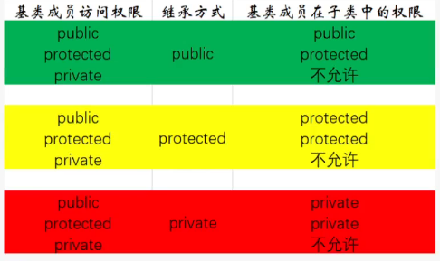

# 面向对象三大特征：封装，继承，多态

## 封装：隐藏实现细节，模块化，用类来封装

访问权限（public, private, protected）, 友元类

属性，方法

## 继承：权限继承（基类成员在子类中最高权限是什么），派生



``` cpp
class A {
    private a;
}
class B: public A {
public:
    using A::a; // 允许访问A中私有变量，修改权限到public
}
```

多继承： 同时继承多个基类

接口继承： 基类是纯虚函数

## 多态： 一个接口多个形态，接口重用

静态多态： 编译器多态，函数重载，参数不同，同名函数

动态多态： 运行时多态，虚函数重写

# 多态实现原理

静态多态-函数重载：

1. 同一作用域多个功能类似的同名函数
2. 参数列表不同（个数，类型，顺序）
3. 不能通过返回值来区别重载

原理：语法分析符号表汇总时，函数名修饰，ZN+类长度+函数名长度+函数名+E+类型首字母，区别不同函数，在目标文件中查看符号表（readelf -s ...）

动态多态-虚函数重写：

1. 在基类函数名前添加 virtual， 在派生中重写
2. 根据对象类型调用不同函数，基类，子类

原理：

1. 早绑定： 编译器编译时确定对象调用的函数的地址
2. 晚绑定： 若类使用virtual关键字，则编译器生成虚函数表（存放虚函数地址），对象构造时初始化该虚表指针

虚函数表：放在类最开始 
``` cpp
typedef void (*Func)(void);

long* vptr1 = (long*)*(long*)entity1;
Func f1 = (FUnc)vptr1[0];

long* vptr2 = (long*)*(long*)entity2;
Func f2 = (FUnc)vptr2[0]; 
```

# 解决菱形继承

前提：多继承

原因：子类继承自父类，父类可能继承自同一个父类

问题： 
1. 浪费存储空间
2. 二义性
```cpp
class A {
    public: 
    int num;
}
class B : public A {

}
class C : public A {

}
class D : public B, public C {

}
int main () {
    D d{};
    d.B::num=1;
    d.C::num=2;
    // 两个num
}
```

解决方法：
虚继承：
1. 子类只继承一次父类的父类
2. 父类使用virtual关键字

`g++ -fdump-class-hierarchy test.cc -o vi`查看内存模型

``` cpp
class A {}

class B: vitrual public A {}
```

原理： 通过虚表偏移来实现虚继承（VTT），父类的vptr都有共同基类的偏移量，从而指向同一个父类

# override final 作用

c++11 引入

## 为什么引入

引入前问题：
1. 虚函数复写：
   1. 不能阻止某一个虚函数进一步复写；
   2. 本来写一个新函数，结果错误重写（virtual可省略），目前仍未解决基类虚函数可复写，但是子类中错误进行复写的问题；
   3. 本来要重写，签名不一样，导致构建一个新的函数
2. 类继承：不能阻止某个类的进一步派生

``` cpp
class A {
    public:
    virtual void Func() {}
    virtual void add() {}
}
class B : public A {
public: 
    virtual void Func() {}
    void Func() {} // 想写新函数，造成复写
    
    virtual void FUnc() {} // 想复写，造成新的函数
    // virtual void FUnc() override {}
    // virtual void Func() const override {}

    virtual void add() final {}
}
class C final : public B { // C不能再被派生
public: 
    // 不希望继续复写Func

    // void add() 不能进一步重写
}
```

## override

进行检查，避免人为出错

1. 指定子类一个虚函数复写父类的虚函数
2. 保证重写的虚函数和基类的虚函数有同样的签名

## final

1. 指定某个虚函数不能在派生类中覆盖，或某个类不能再派生
2. 阻止类进一步派生
3. 阻止虚函数进一步复写

# cpp 类型推导

用处：
1. 模板参数的推导（同auto）
2. auto， decltype

为什么引入类型推导
1. cpp 是强类型语言
2. 编译器处理类型推导
3. 提升语言编码效率
   
## 关键字-auto
1. 用于推导变量的类型，必须进行初始化，编译器通过初始值进行推导类型
2. 规则：auto变量在定义时必须初始化；auto同时定义多个变量，这些变量必须为同一类型
3. 类型推导时会丢失引用，const， volitle 语义
4. 如果auto& 则保存了引用和cv属性 
5. 万能应用auto&&，根据初始值的属性来判断是左值还是右值引用
6. auto不能推导数组类型，推导出指针类型
7. cpp14中可以推导函数的返回值类型

应用：
1. 尽量用auto申明变量，除非影响可读性
2. 使用容器迭代器
3. 匿名函数（lambda）放回值
4. 模板函数中，节约模板参数类型

## 关键字-decltype

原理：
1. 用于推导表达式的类型，编译器只分析表达式类型，而不进行运算
2. 规则：
   1. exp是普通表达式，推导表达式类型
   2. exp是是函数调用，推导函数返回值类型
   3. exp是左值，推导左值引用
```cpp
int a=1;
float b=2.0
decltype(a+b) c = a+b;

auto f = [](int a, double d) {return a+b;}; 
decltype(f(a,b)) d = b;

decltype(a+=b) e = a;
e = 13;
```

应用：范型编程

# function, lambda, bind 关系
## function

### std::function 类模板

1. 是一个抽象了函数参数以及返回值的类模板
2. 抽象：
   1. 把任意函数包装成一个对象，该对象可以保存，传递，复制 
   2. 动态绑定：赋值不同的function对象
3. 用途：
   1. 保存普通函数，类静态成员函数
   2. 保存仿函数
   3. 保存类成员函数
   4. 保存lambda表达式
   5. 保存bind的返回对象

### 仿函数（函数对象）

1. 重载了操作符（）的类
2. 特征：
   1. 可以有状态，可以通过成员变量**存储**状态
   2. 有状态的函数对象称之为闭包

``` cpp
class Hello {
public:
    void operator() (int count) {
        i+=count;
    }
    void operator() (int a, int b) {
        cout << a+b << endl;
    }
    int i;
}
function<void(int)> func1=Hello(); 
// -> the first function in Hello;
function<void(int, int)> func2=Hello();
// -> the seconed function in Hello;
```
   
### lambda表达式
1. 一种语法糖，创建匿名函数
2. []是捕获列表
   1. 值捕获：只写不修改，使用mutable可读可写但不修改外部的值（形成闭包）
   2. 引用捕获
   3. 本质是将外部变量转变为类的成员变量
3. ()是参数列表
4. -> 返回值类型指定
5. {} 函数体
6. 原理：编译时将lambda表达式转变为一个函数对象
``` cpp
int i=0;
auto f = [i](int count) -> void {
    i++;
};
// 转化成如下类
class LambdaHello {
public:
    LambdaHello(int _i): i(_i) {}
    void operator() (int count) {
        i++;
    }
private:
    int i;
    // int& i; // 如果是引用捕获
}
```

### bind 函数适配器

1. 通过绑定函数以及函数参数的方式生成函数对象的模板函数
2. 提供了占位符，实现灵活参数绑定
3. 特征：
   1. 绑定函数以及函数参数，从而构成函数对象(闭包)
   2. 允许修改参数顺序


``` cpp
auto f = bind(Hello(), 1);
// auto f = bind(&Hello, 1);
f();

Hello hello;
auto f = bind(Hello::func, &hello, 1);

auto f = bind(Hello::func, &hello, placeholders::_1);
f(12);


// bind 相当于生成如下类
class BindHello {
public:
    BindHello(function<void(int)> _fn, int _count): fn(_fn), count(_count) {}
    void operator() () {
        fn(count);
    }
private:
    function<void(int)> fn;
    int count;
}
```

# 继承下构造函数和析构函数的执行顺序

继承下，构造函数按照依赖链，从上往下进行构造；析构函数按照依赖链，从下往上进行析构；

## 单继承

继承中：优先构造父类， 优先析构子类

成员中：优先构造父类，再构造成员类，最后构造本身；析构与之相反 

## 多继承

继承中：按顺序构造父类

成员中：按申明顺序构造成员类

最后构造自己

析构顺序相反

# 虚函数和虚函数表的创建时机

## 虚函数表创建时机

1. 编译器发现类中包含virtual关键字修饰的函数
2. 在编译阶段生成
3. 在.o(ELF)文件的全局数据端只读数据段中
4. 是存放虚函数地址的数组

## 虚函数表指针的创建时机

1. 类对象构造时，在构造函数中，将虚函数表的地址赋值给对象vptr
2. 若没有构造函数会生成默认构造函数，从而为类对象初始化vptr
3. 继承下虚函数表赋值过程：
   1. 调用基类构造函数将基类的虚函数表地址赋值给vptr
   2. 在调用子类构造函数时，将子类的虚函数表地址赋值给vptr(前提是进行了覆盖)

# 虚析构函数的作用

1. 在继承下，为了使子类析构函数得到正常调用，需要将基类析构函数设置为虚析构函数
2. 子类对象指针赋值给基类对象指针，子类对象析构函数得不到调用
3. 为什么这样设计：
   1.  cpp看来，我们设计某个类的时候，不一定是基类
   2.  如果该类是基类，应该将基类的析构函数设置为虚函数
   3.  设置虚析构函数有代价，编译器生成虚函数表，每个对象都要有vptr

``` cpp
class Base { 
    virtual ~Base() { cout << "Base::~Base()" << endl;}
};
class Drive: public Base {
    ~Drive() { cout << "Drive::~Drive()" <endl;}
};

int main() {
    Base *p = new Drive(); // 早绑定
    delete p; // 只会调用Base的析构函数
    return 0;
}
```

# 智能指针种类以及使用场景

1. 指针管理的困境
   1. 资源已经释放，但指针没有置空
      1. 野指针，只有一个指针指向资源
      2. 指针悬挂，多个指针指向同一个资源
      3. 踩内存
   2. 没有释放指针，产生内存泄漏
   3. 重复释放资源，引发core dump
2. 解决方法
   1. 智能指针采用 RAII 思想，来自动化管理指针的动态资源的释放
   2. RAII 利用了对象的生命周期来管理程序资源
   3. 智能指针利用构造函数和析构函数来管理资源
3. 智能指针种类（cpp 11） 
   1. shared_ptr 
      1. 共享所有权
      2. 资源没有明确的管理者
      3. 原理：引用计数
      4. 容器中管理指针,资源通过函数传递
      5. 使用规范：使用shared_ptr管理动态资源的时候，不要使用原来的裸指针
         1. 构造智能指针的时候，不要暴露裸指针
         2. 尽量使用make_shared 来构造智能指针
         3. 不要通过get来操作裸指针
         4. 不要用一个指针来构造多个智能指针对象
         5. 不要用类对象（this）作为shared_ptr返回
   2. weak_pt
      1. 辅助shared_ptr 用来解决循环引用的问题，原因是弱引用不占用引用计数
   3. unique_ptr
      1. 独享所有权
      2. 没有赋值运算操作符
      3. 仅提供了移动构造和移动赋值
      4. 明确了某个对象只有一个拥有者
      5. 使用规范：
         1. 不支持拷贝，但是可以从函数中返回一个unique_ptr

``` cpp
{
    int* p = new int;
    delete p;
    p = nullptr;
}
{
    int* p = new int;
    int* p1 = p;
    int* p2 = p;
    delete p;
    p = nullptr;
    // ...
}
{
    void func(int* p) {
        if(/* condition */)
            return;
        delete p;
    }
    int* p = new int;
    func(p);
}
{
    int* p = new int;
    delete p;
    // ...
    delete p;
}

class T{}
vector<shared_ptr<T>> vec;
vec.claer();

// ------

// 暴露了裸指针
int* p = new int;
shared_ptr<int> sp = shared_ptr<int>(p);

// 没有暴露
shared_ptr<int> sp  = shared_ptr<int>(new int);

shared_ptr<int> sp = make_shared<int>();

class T: public enable_shared_from_this<T> {
public: 
    shared_ptr<T> self() {
        return shared_from_this();
    }
};
// 不要用类对象（this）作为shared_ptr返回

class T1;
unique_ptr><T1> get_unique() {
    unique_ptr<T1> up;
    return up;
}
```

循环引用问题,使用weak_ptr不会增加引用计数

``` cpp
class B;
class A {
public:
    ~A() {};
    shared_ptr<B> spb;
}
class B {
public:
    ~B() {};
    shared_ptr<A> spa;
}
int main() {
    shared_ptr<A> pa = make_shared<A>();
    shared_ptr<B> pb = make_shared<B>();
    pa->spb = pb;
    pb->spa = pa;
    return 0;
}
```

# c++ 11 特性

## 语法糖

关键字
1. auto, decltype
2. nullptr, 原来的NULL(void* 类型)
3. final, override: 虚函数
4. constexpr

语法
1. 基于范围的for循环 for(auto i: range) or auto&
2. function函数对象：bind, lambda

    目的
   1. 减少代码量
   2. 减少错误，更加严谨
   3. 编译器做更多的事情

stl容器
1. array
2. forward_list
3. unordered_map
4. unordered_set

智能指针
1. shared_ptr
2. unique_ptr

多线程
1. thread
2. mutex, lock_guard
3. conditoin_variable
4. atomic

右值引用
1. T&&
2. 将亡值 除法移动构造和移动拷贝构造
3. 实现移动语义 std::move
4. 实现完美转发 万能引用T&&, std::forward 

# 动态库和静态库的区别

生成方式：
``` shell
g++ -c add.cpp -o add.o
g++ -c del.cpp -o del.o

# 静态库文件
# rcs: replace creat search
ar rcs libapi.a del.o add.o

# 动态库文件
g++ -shared -fPIC -o libapi.so add.o del.o

# 生成可执行文件
# -L 库搜索路径
# -I 头文件搜索路径
g++ -static main.cpp -o static_main -L./ -lapi -I./
# 可直接运行

g++ main.cpp -o dynamic_main -L./ -lapi -I./
# 不可直接运行，需要添加库文件路径
export LD_LIBRARY_PATH=$LD_LIBRARY_PATH:/path/to/you/dynamic/library
```

## 静态库

静态链接：把静态库编译进目标文件

空间占用：静态库会编译进多个文件，存在多个副本，占用空间大

使用方式：直接运行

执行速度：快

## 动态库


动态链接：没有把库编译进目标文件，程序运行时加载运行代码（地址无关代码技术 -fPIC）（装载重定位），在链接时只做语法检查

空间占用：动态库只编译一个副本，只占一个地址，占用空间小

使用方式：程序是动态加载，程序环境需要指定动态库的路径LD_LIBRARY_PATH

执行速度：慢（相对静态链接慢）

## 库文件发生变动
1. 接口改变（函数名等）： 都需要重新编译
2. 接口实现改变： 静态库全都需要重新编译；动态库只需要重新编译动态库文件

# 左值引用与右值引用的区别

引用：别名，申明时要初始化，通过引用修改变量值

左值引用对左值进行引用，右值引用对右值进行引用

## 功能差异

左值引用：避免对象的拷贝 拷贝，函数返回值

右值应用：实现移动语义，实现完美转发

const左值引用能指向右值，但局限不能修改

右值引用通过std::move可以指向左值

申明出来的左值或右值引用都是左值

移动语义：避免拷贝，避免资源重新分配，stl应用广泛，实现std::unique_ptr

完美转发：函数模板可以将自己的参数完美地转发给内部调用的其他函数；完美是指不仅能准确地转发此参数的值，还能保证转发的左右值属性

cpp11前不是完美转发

使用T&&实现转发语义,引入了引用折叠规则：参数为左值或左值引用，T&& 将转化为 A&(类型推导);参数为右值引用，T&& 将转化为 A&&

通过std::forward<T>(value)： T为左值引用类型，v转化为T类型的左值；T为右值引用类型，v转化为T类型的右值

``` cpp
template<typename T> 
void revoke(T&& t) {
    func(forward<T>(t));
}

```

## 区分左右值

### 左值

**可以**在等号左边，能进行取地址，有名字  int a = 1; int b = a;

1. 变量名
2. 返回左值引用的函数调用
3. 前置自增自减：
   1. ++i: 返回的就是i
4. 赋值运算和复合赋值运算
   1. (i = 9) = 100 -> i = 100
   2. (i+=10) = 1000 -> i = 1000
   3. 返回的就是i
5. 解引用表达式 Class* a; *a = new Class();

### 右值

**只能**放在等号右边，不能取地址，没有名字

1. 纯右值
   1. 字面值 i = 10；
   2. 返回非引用的函数调用
   3. 后置自增自减
      1. i++: 先拷贝i,再i+1,并赋值给i,返回的是副本
      2. (i++) = 10000; -> 编译报错
   4. 算数表达式
   5. 逻辑表达式
   6. 比较表达式
2. 将亡值
   1. cpp11引入，移动语义相关
   2. 用来触发移动构造或移动赋值构造，进行资源转移，之后将将亡值进行析构
   3. std::move, static_cast<T&&>(x)将左值转化为将亡值：将左值转化为右值，拷贝变为移动